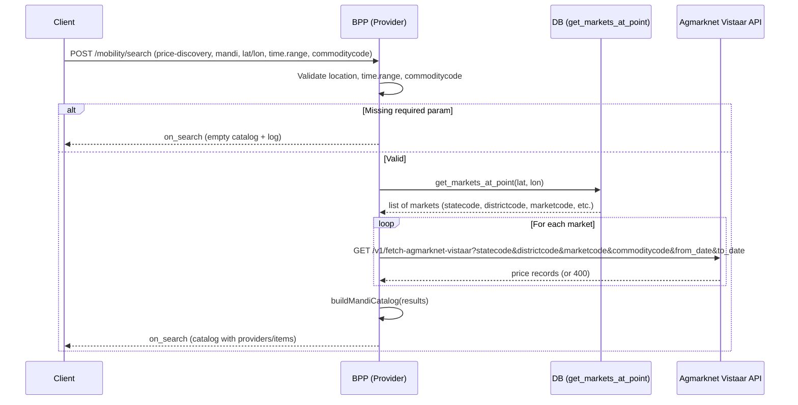

# Mandi Price Discovery Flow

This document describes the end-to-end flow for **Mandi Price Discovery** (price-discovery + mandi) in the Beckn provider: search by location, date range, and commodity code; resolve markets via `get_markets_at_point`; fetch prices from Agmarknet Vistaar API; return on_search catalog.

· Version: 1.1.0  
· Domain: schemes:vistaar  
· Last Updated: Feb 2026 by Kenpath Technology Pvt Ltd  
· Author: Akshat Rana  
· Date: 2026-02-07

---

## Overview


**Search.** The client calls **search** with `intent.category.descriptor.code` = `"price-discovery"` and `intent.item.descriptor.code` = `"mandi"`.

**Required in fulfillment.** The object `message.intent.fulfillment.stops[0]` must include:

- **location** — `lat` and `lon` (strings), or `gps` as `"lat,lon"`. Used to resolve markets at that point.
- **time.range** — `start` and `end` as ISO date strings. Converted to dd-MM-yyyy and sent to the price API as from_date / to_date.
- **commoditycode** — A number (e.g. `2` for Paddy). Sent to Agmarknet for every market.

**Provider behaviour.** The provider resolves markets at the point using the DB function `get_markets_at_point(lat, lon)`. For each market it calls the Agmarknet Vistaar API with statecode, districtcode, marketcode, commoditycode, and the date range. All results are combined into a single **on_search** catalog.

---

## High-Level Sequence



---

## Search – Mandi Price Discovery

**Endpoint:** `POST /mobility/search`

**Routing.** The mandi flow is used when:

- `message.intent.category.descriptor.code` = `"price-discovery"`
- `message.intent.item.descriptor.code` = `"mandi"`

**Required request parameters.** All of the following must be present in `message.intent.fulfillment.stops[0]`. If any is missing, the provider returns **on_search** with an empty catalog and logs a warning.

- **location** — At `fulfillment.stops[0].location`. Provide either `lat` and `lon` (strings) or `gps` as `"lat,lon"`. These coordinates are passed to `get_markets_at_point(lat, lon)` to resolve which markets cover the point.
- **time.range** — At `fulfillment.stops[0].time.range`. Both `start` and `end` (ISO date strings) are required. They are converted to dd-MM-yyyy and sent to the Agmarknet API as from_date and to_date.
- **commoditycode** — At `fulfillment.stops[0].commoditycode`. Must be a number (e.g. `2` for Paddy). This value is sent to Agmarknet for each market.

**Example request (relevant parts):**

```json
{
  "context": {
    "domain": "schemes:vistaar",
    "action": "search",
    "version": "1.1.0",
    "bap_id": "bap-network-playground-sandbox-vistaar.da.gov.in",
    "bap_uri": "https://bap-network-playground-sandbox-vistaar.da.gov.in",
    "bpp_id": "bpp-network-playground-sandbox-vistaar.da.gov.in",
    "bpp_uri": "https://bpp-network-playground-sandbox-vistaar.da.gov.in",
    "transaction_id": "{{$randomUUID}}",
    "message_id": "{{$randomUUID}}",
    "timestamp": "{{$timestamp}}",
    "ttl": "PT10M",
    "location": { "country": { "code": "IND" }, "city": { "code": "*" } }
  },
  "message": {
    "intent": {
      "category": { "descriptor": { "code": "price-discovery" } },
      "item": { "descriptor": { "code": "mandi" } },
      "fulfillment": {
        "stops": [
          {
            "location": { "lat": "21.6571", "lon": "82.1612" },
            "time": {
              "range": {
                "start": "2025-08-20T00:00:00.000Z",
                "end": "2025-08-20T00:00:00.000Z"
              }
            },
            "commoditycode": 2
          }
        ]
      }
    }
  }
}
```

**Behaviour.**

1. **Validation.** If `lat`/`lon`, `time.range.start`/`end`, or `commoditycode` is missing, the provider returns **on_search** with `message.catalog.descriptor.name` = `"Mandi Price Discovery"`, `providers: []`, and logs which field is missing.

2. **Resolve markets.** The provider calls the DB: `get_markets_at_point(lat, lon)`. The result is a list of markets with state_code, district_code, market_code, etc., which the code maps to statecode, districtcode, marketcode.

3. **Fetch prices.** For each market row the provider calls the Agmarknet Vistaar API: GET `{MANDI_BASE_URL}/v1/fetch-agmarknet-vistaar` with query params token, statecode, from_date, to_date, commoditycode, districtcode, marketcode. The dates come from `time.range.start`/`end` converted to dd-MM-yyyy; commoditycode comes from the request (same for all markets). If a call returns 400 or 5xx, that market is skipped (and logged); the rest are still processed.

4. **Build catalog.** All successful API responses are aggregated. The provider builds one provider **"Mandi Price Discovery"** with one catalog item per price record. Each item has tags for State, District, Market, Commodity, Modal Price, Min Price, Max Price, Price Unit, Arrival Date, and when present Grade, Group, Variety (from the Agmarknet response).

5. **Response.** The provider returns **on_search** with `context.action` = `"on_search"` and `message.catalog` (descriptor plus providers with items).

---

## Data Flow

### DB: get_markets_at_point(lat, lon)

The provider uses a PostgreSQL function that returns markets containing the given point (e.g. polygon/geometry based). The query selects:

- `state_code` as stateCode → mapped to **statecode**
- `state` → **state**
- `district_code` as districtCode → **districtcode**
- `district_name` as district → **district_name**
- `market_code` as marketCode → **marketcode**
- `market_name` as marketName (optional, for display)

The **statecode**, **districtcode**, and **marketcode** sent to Agmarknet must use the same scheme the API expects; otherwise the API may return 400 for that market.

### Agmarknet Vistaar API

- **Method:** GET  
- **URL:** `{MANDI_BASE_URL}/v1/fetch-agmarknet-vistaar`  
- **Query params:** token, statecode, from_date, to_date, commoditycode, districtcode, marketcode  
- **Date format:** dd-MM-yyyy (e.g. `20-08-2025`)  
- **Example (working):**  
  `...?token=***&statecode=CG&from_date=20-08-2025&to_date=20-08-2025&commoditycode=2&districtcode=96&marketcode=2056`

**Example API response (array of records):**

```json
[
  {
    "Grade": "Non-FAQ",
    "Group": "Cereals",
    "State": "Chattisgarh",
    "Market": "Kasdol APMC",
    "Variety": "D.B.",
    "District": "Balodabazar",
    "Commodity": "Paddy(Common)",
    "Max Price": "2000",
    "Min Price": "2000",
    "Price Unit": "Rs./Qtl",
    "Modal Price": "2000",
    "Arrival Date": "20-08-2025"
  }
]
```

### on_search catalog shape

- **Catalog descriptor:** `name: "Mandi Price Discovery"`.
- **One provider:** id `mandi-price-discovery`, with a fulfillment stop at the request (lat, lon).
- **Items:** One item per price record. Each item has:
  - **descriptor.name** — `"{Commodity} - {Market}"`
  - **descriptor.short_desc** — `"{Commodity} at {Market}, {District}, {State}"`
  - **tags** — A price-info list with State, District, Market, Commodity, Modal Price, Min Price, Max Price, Price Unit, Arrival Date, and when present Grade, Group, Variety.

---

## When Required Params Are Missing

If any of **location (lat/lon)**, **time.range.start**, **time.range.end**, or **commoditycode** is missing, the provider does not call the DB or Agmarknet. It returns **on_search** with `context.action` = `"on_search"` and `message.catalog` = `{ descriptor: { name: "Mandi Price Discovery" }, providers: [] }`, and logs a warning indicating which required parameter is missing.

---

## Environment / Config

- **MANDI_BASE_URL** — Base URL for the Agmarknet Vistaar API (e.g. `http://34.0.4.235:8080`).
- **MANDI_TOKEN** — Token for API auth (sent as query param `token`).
- **IMD_DB_*** / **WEATHER_DB_*** — Database connection used for `get_markets_at_point` (same pool as weather/IMD).

---

## Quick Reference

**Single step:** POST `/mobility/search` with intent category code `price-discovery` and item code `mandi`. In `fulfillment.stops[0]` provide location (lat, lon), time.range (start, end), and commoditycode (number).

**Response.** The provider always returns **on_search** with `message.catalog`. If validation fails or there are no markets/prices, the catalog is empty; otherwise it contains one provider with items built from Agmarknet price records.