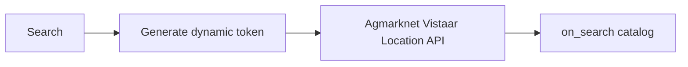
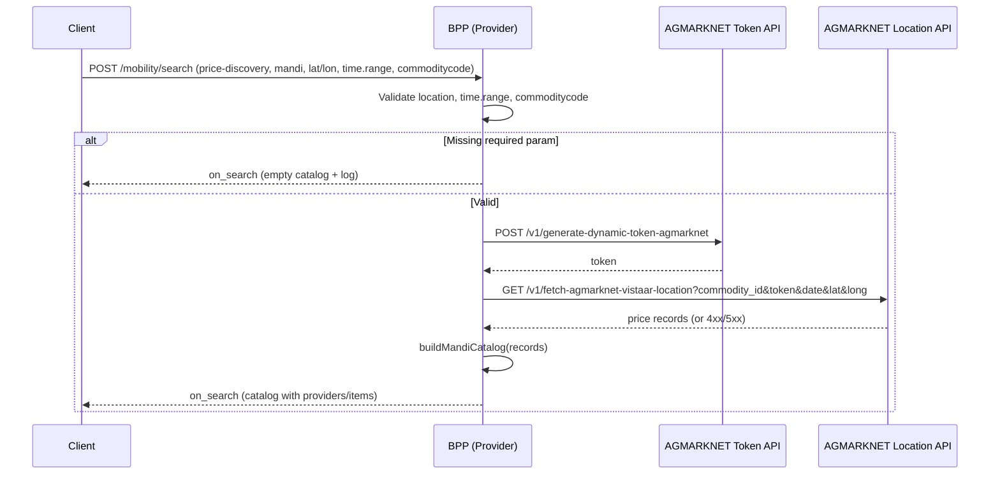

# Mandi Price Discovery Flow

This document describes the end-to-end flow for **Mandi Price Discovery** (price-discovery + mandi) in the Beckn provider: search by location, date range, and commodity code; generate AGMARKNET dynamic token; fetch prices from AGMARKNET location API; return on_search catalog.

· Version: 1.1.0  
· Domain: schemes:vistaar  
· Last Updated: Feb 2026 by Kenpath Technology Pvt Ltd  
· Author: Akshat Rana  
· Date: 2026-02-07

---

## Overview



**Search.** The client calls **search** with `intent.category.descriptor.code` = `"price-discovery"` and `intent.item.descriptor.code` = `"mandi"`.

**Required in fulfillment.** The object `message.intent.fulfillment.stops[0]` must include:

- **location** — `lat` and `lon` (strings), or `gps` as `"lat,lon"`. Used directly for AGMARKNET location lookup.
- **time.range** — `start` and `end` as ISO date strings. Converted to dd-MM-yyyy; the provider uses `end` (or `start` fallback) as single `date` for the location API.
- **commoditycode** — A number (e.g. `2` for Paddy). Mapped to AGMARKNET `commodity_id`.

**Provider behaviour.** The provider generates a dynamic token using AGMARKNET credentials, then calls the AGMARKNET location endpoint with `commodity_id`, `token`, `date`, `lat`, and `long`. The returned records are mapped into a single **on_search** catalog.

---

## High-Level Sequence



---

## Search – Mandi Price Discovery

**Endpoint:** `POST /mobility/search`

**Routing.** The mandi flow is used when:

- `message.intent.category.descriptor.code` = `"price-discovery"`
- `message.intent.item.descriptor.code` = `"mandi"`

**Required request parameters.** All of the following must be present in `message.intent.fulfillment.stops[0]`. If any is missing, the provider returns **on_search** with an empty catalog and logs a warning.

- **location** — At `fulfillment.stops[0].location`. Provide either `lat` and `lon` (strings) or `gps` as `"lat,lon"`. These coordinates are passed to AGMARKNET location API as `lat` and `long`.
- **time.range** — At `fulfillment.stops[0].time.range`. Both `start` and `end` (ISO date strings) are required. They are converted to dd-MM-yyyy; `end` is used as `date` for AGMARKNET (with `start` fallback).
- **commoditycode** — At `fulfillment.stops[0].commoditycode`. Must be a number (e.g. `2` for Paddy). This is mapped to AGMARKNET `commodity_id`.

**Example request (relevant parts):**

```json
{
  "context": {
    "domain": "schemes:vistaar",
    "action": "search",
    "version": "1.1.0",
    "bap_id": "bap-network-playground-sandbox-vistaar.da.gov.in",
    "bap_uri": "https://bap-network-playground-sandbox-vistaar.da.gov.in",
    "bpp_id": "bpp-network-playground-sandbox-vistaar.da.gov.in",
    "bpp_uri": "https://bpp-network-playground-sandbox-vistaar.da.gov.in",
    "transaction_id": "{{$randomUUID}}",
    "message_id": "{{$randomUUID}}",
    "timestamp": "{{$timestamp}}",
    "ttl": "PT10M",
    "location": { "country": { "code": "IND" }, "city": { "code": "*" } }
  },
  "message": {
    "intent": {
      "category": { "descriptor": { "code": "price-discovery" } },
      "item": { "descriptor": { "code": "mandi" } },
      "fulfillment": {
        "stops": [
          {
            "location": { "lat": "21.6571", "lon": "82.1612" },
            "time": {
              "range": {
                "start": "2025-08-20T00:00:00.000Z",
                "end": "2025-08-20T00:00:00.000Z"
              }
            },
            "commoditycode": 2
          }
        ]
      }
    }
  }
}
```

**Behaviour.**

1. **Validation.** If `lat`/`lon`, `time.range.start`/`end`, or `commoditycode` is missing, the provider returns **on_search** with `message.catalog.descriptor.name` = `"Mandi Price Discovery"`, `providers: []`, and logs which field is missing.

2. **Generate token.** The provider calls `POST {MANDI_BASE_URL}/v1/generate-dynamic-token-agmarknet` with `access_name` and `password`.

3. **Fetch prices by location.** The provider calls `GET {MANDI_BASE_URL}/v1/fetch-agmarknet-vistaar-location` with query params `commodity_id`, `token`, `date`, `lat`, `long`.

4. **Build catalog.** The provider builds one provider **"Mandi Price Discovery"** with one catalog item per price record. Each item has tags for State, District, Market, Commodity, Modal Price, Min Price, Max Price, Price Unit, Arrival Date, and when present Grade, Group, Variety.

5. **Response.** The provider returns **on_search** with `context.action` = `"on_search"` and `message.catalog` (descriptor plus providers with items).

---

## Data Flow

### AGMARKNET Token API

- **Method:** POST  
- **URL:** `{MANDI_BASE_URL}/v1/generate-dynamic-token-agmarknet`  
- **Body:** `{"access_name":"...","password":"..."}`  
- **Response:** token string at `response.token`

### AGMARKNET Location API

- **Method:** GET  
- **URL:** `{MANDI_BASE_URL}/v1/fetch-agmarknet-vistaar-location`  
- **Query params:** `commodity_id`, `token`, `date`, `lat`, `long`  
- **Date format:** dd-MM-yyyy (e.g. `20-08-2025`)  
- **Example:**  
  `...?commodity_id=2&token=***&date=20-08-2025&lat=21.6571&long=82.1612`

**Example API response (array of records):**

```json
[
  {
    "Grade": "Non-FAQ",
    "Group": "Cereals",
    "State": "Chattisgarh",
    "Market": "Kasdol APMC",
    "Variety": "D.B.",
    "District": "Balodabazar",
    "Commodity": "Paddy(Common)",
    "Max Price": "2000",
    "Min Price": "2000",
    "Price Unit": "Rs./Qtl",
    "Modal Price": "2000",
    "Arrival Date": "20-08-2025"
  }
]
```

### on_search catalog shape

- **Catalog descriptor:** `name: "Mandi Price Discovery"`.
- **One provider:** id `mandi-price-discovery`, with a fulfillment stop at the request (lat, lon).
- **Items:** One item per price record. Each item has:
  - **descriptor.name** — `"{Commodity} - {Market}"`
  - **descriptor.short_desc** — `"{Commodity} at {Market}, {District}, {State}"`
  - **tags** — A price-info list with State, District, Market, Commodity, Modal Price, Min Price, Max Price, Price Unit, Arrival Date, and when present Grade, Group, Variety.

---

## When Required Params Are Missing

If any of **location (lat/lon)**, **time.range.start**, **time.range.end**, or **commoditycode** is missing, the provider does not call AGMARKNET. It returns **on_search** with `context.action` = `"on_search"` and `message.catalog` = `{ descriptor: { name: "Mandi Price Discovery" }, providers: [] }`, and logs a warning indicating which required parameter is missing.

---

## Environment / Config

- **MANDI_BASE_URL** — Base URL for the Agmarknet Vistaar API (e.g. `http://34.0.4.235:8080`).
- **MANDI_ACCESS_NAME** — Access name for dynamic token generation.
- **MANDI_PASSWORD** — Password for dynamic token generation.
- **MANDI_TOKEN** — Optional fallback token if token generation fails.

---

## Quick Reference

**Single step:** POST `/mobility/search` with intent category code `price-discovery` and item code `mandi`. In `fulfillment.stops[0]` provide location (lat, lon), time.range (start, end), and commoditycode (number).

**Response.** The provider always returns **on_search** with `message.catalog`. If validation fails or there are no records, the catalog is empty; otherwise it contains one provider with items built from AGMARKNET location price records.
