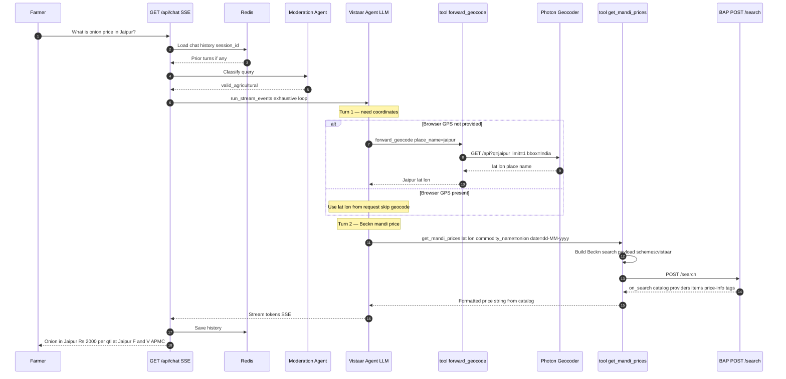
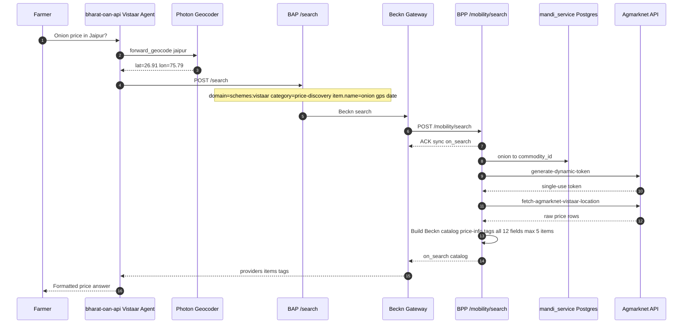

# Vistaar Mandi Price Integration — Approach Document

**Domain:** `schemes:vistaar`  
**Integration:** Mandi v2 (commodity name + GPS)  
**Repos:** `bharat-oan-api` (AI Layer) · `barath-vistaar-provider-backend` (BPP)

---

## 1. Executive Summary

The Vistaar farmer chatbot answers mandi (wholesale market) price queries through a Beckn-based integration. The farmer asks in natural language (e.g. *"What is onion price in Jaipur?"*). The **AI layer** geocodes the location and sends a Beckn search to the **BAP**. The **BPP** resolves the commodity name in Postgres, calls **Agmarknet** for GPS-based prices, and returns a standard Beckn `on_search` catalog. The LLM formats the answer for the farmer.

All Vistaar use cases share **`context.domain = schemes:vistaar`**. Mandi is routed by payload shape (`price-discovery` + `item.descriptor.name` + GPS), not by a separate domain.

---

## 2. Architecture Components

| Layer | Component | Role |
|-------|-----------|------|
| Client | Farmer app / web / WhatsApp | Sends query, receives streamed answer |
| AI Layer | `bharat-oan-api` | NLU, moderation, geocoding, Beckn tool calls, answer formatting |
| Geocoding | Photon (`:2322`) | Place name → lat/lon (India bbox) |
| Beckn BAP | BAP network | `POST {BAP_ENDPOINT}/search` |
| Beckn Gateway | ONIX | Routes `schemes:vistaar` to BPP |
| BPP | `barath-vistaar-provider-backend` | `POST /mobility/search` → `on_search` |
| Database | `mandi_service` Postgres | Commodity cache (~604 items); string → `commodity_id` |
| External API | Agmarknet | `generate-dynamic-token` + `fetch-agmarknet-vistaar-location` |

---

## 3. Design Principles

1. **Single Beckn domain** — `schemes:vistaar` for all Vistaar use cases.
2. **Geocoding in AI** — Photon runs in `bharat-oan-api`; BPP receives `gps` in Beckn fulfillment.
3. **Commodity resolution in BPP** — LLM sends `item.descriptor.name` (text); BPP maps to `commodity_id` via Postgres.
4. **Standard Beckn catalog response** — Same structure as legacy mandi: `providers` → `items` → `price-info` tags with all 12 Agmarknet fields.
5. **No large data to LLM** — 604-commodity master stays in Postgres; max 5 price items returned per query.
6. **Weekly commodity sync** — Agmarknet `master-data?option=2` refreshes Postgres cache.

---

## 4. AI Layer — Sequence Diagram

*Figure 1: AI layer flow (`bharat-oan-api`)*



### 4.1 AI Layer — What It Does

| Step | Action |
|------|--------|
| 1 | Receive farmer query via SSE chat API |
| 2 | Moderation — validate agricultural intent |
| 3 | Geocode — `forward_geocode` → Photon (if no browser GPS) |
| 4 | Call `get_mandi_prices(lat, lon, commodity_name, date)` |
| 5 | Tool POSTs Beckn search to BAP; receives `on_search` |
| 6 | LLM formats answer from catalog tags (no raw Agmarknet API in AI) |

### 4.2 AI Layer — What It Does NOT Do

- Does not call Agmarknet directly
- Does not use `search_commodity` or numeric `commoditycode`
- Does not hold 604-commodity master in memory
- Does not send full Agmarknet JSON to the LLM

### 4.3 AI Tool Signature

```
get_mandi_prices(
    latitude: float,
    longitude: float,
    commodity_name: str,    # e.g. "onion" — BPP resolves to commodity_id
    date: str | None = None # dd-MM-yyyy; default today
) -> str
```

---

## 5. Beckn Payload — AI Layer → BAP

### 5.1 Request Fields

| Field | Value / Purpose |
|-------|-----------------|
| `context.domain` | `schemes:vistaar` |
| `context.action` | `search` |
| `context.transaction_id` | UUID — trace all logs |
| `context.message_id` | UUID |
| `category.descriptor.code` | `price-discovery` |
| `item.descriptor.name` | Commodity string e.g. `"onion"` |
| `fulfillment.end.location.gps` | `"lat,lon"` from Photon or browser |
| `fulfillment.end.location.descriptor.name` | Place name e.g. `"Jaipur"` |
| `tags[code=date].value` | `dd-MM-yyyy` e.g. `"24-06-2026"` |

**Not used in v2:** `item.descriptor.code=mandi`, `fulfillment.stops[0].commoditycode`

### 5.2 Sample Beckn Search Payload

```json
{
  "context": {
    "domain": "schemes:vistaar",
    "action": "search",
    "version": "1.1.0",
    "transaction_id": "txn-uuid-here",
    "message_id": "msg-uuid-here",
    "bap_id": "bap-network-playground-sandbox-vistaar.da.gov.in",
    "bap_uri": "https://bap-network-playground-sandbox-vistaar.da.gov.in",
    "bpp_id": "bpp-network-playground-sandbox-vistaar.da.gov.in",
    "bpp_uri": "https://bpp-network-playground-sandbox-vistaar.da.gov.in",
    "timestamp": "2026-06-24T10:00:00.000Z",
    "ttl": "PT10M"
  },
  "message": {
    "intent": {
      "category": { "descriptor": { "code": "price-discovery" } },
      "item": { "descriptor": { "name": "onion" } },
      "fulfillment": {
        "end": {
          "location": {
            "descriptor": { "name": "Jaipur" },
            "gps": "26.9124,75.7873"
          }
        }
      },
      "tags": [{ "code": "date", "value": "24-06-2026" }]
    }
  }
}
```

---

## 6. Beckn BPP — Processing Steps

**Endpoint:** `POST /mobility/search`  
**Route:** `mandi-location` when `category=price-discovery` + `item.descriptor.name` present (no `commoditycode`)

| Step | BPP Action |
|------|------------|
| 1 | Receive Beckn search; log `[mandiLocationSearch][txn:uuid]` |
| 2 | Parse intent — commodity name, gps, location name, date |
| 3 | Postgres lookup — `commodities` + `commodity_terms` → `commodity_id` |
| 4 | If ambiguous / not found → `on_search` with `providers: []` + `search-context` tags |
| 5 | `POST` Agmarknet `generate-dynamic-token` |
| 6 | `GET` Agmarknet `fetch-agmarknet-vistaar-location` (id, lat, lon, date, token) |
| 7 | Build Beckn catalog — one item per price row (max 5) |
| 8 | Return synchronous `on_search` to Gateway → BAP → AI |

### 6.1 Agmarknet Price API — Raw Response Fields

```json
{
  "Grade": "FAQ",
  "Group": "Vegetables",
  "State": "Rajasthan",
  "Market": "Jaipur (F&V) APMC",
  "Variety": "Other",
  "District": "Jaipur",
  "Commodity": "Onion",
  "Max Price": "2500",
  "Min Price": "1500",
  "Price Unit": "Rs./Qtl",
  "Modal Price": "2000",
  "Arrival Date": "24-06-2026"
}
```

### 6.2 Beckn `on_search` — All Fields in `price-info` Tags

Each price row becomes one catalog **item** with a `price-info` tag list:

| Agmarknet field | Beckn tag `descriptor.code` |
|-----------------|----------------------------|
| Grade | `Grade` |
| Group | `Group` |
| State | `State` |
| Market | `Market` |
| Variety | `Variety` |
| District | `District` |
| Commodity | `Commodity` |
| Max Price | `Max Price` |
| Min Price | `Min Price` |
| Price Unit | `Price Unit` |
| Modal Price | `Modal Price` |
| Arrival Date | `Arrival Date` |

**Item descriptor:** `"Onion - Jaipur (F&V) APMC"`  
**Item short_desc:** `"Onion at Jaipur (F&V) APMC, Jaipur, Rajasthan"`

### 6.3 Sample `on_search` Catalog Item

```json
{
  "context": { "action": "on_search", "domain": "schemes:vistaar" },
  "message": {
    "catalog": {
      "descriptor": { "name": "Mandi Price Discovery" },
      "providers": [
        {
          "id": "mandi-price-discovery",
          "items": [
            {
              "id": "mandi-1",
              "descriptor": {
                "name": "Onion - Jaipur (F&V) APMC",
                "short_desc": "Onion at Jaipur (F&V) APMC, Jaipur, Rajasthan"
              },
              "tags": [
                {
                  "descriptor": { "code": "price-info" },
                  "list": [
                    { "descriptor": { "code": "Grade" }, "value": "FAQ" },
                    { "descriptor": { "code": "Group" }, "value": "Vegetables" },
                    { "descriptor": { "code": "State" }, "value": "Rajasthan" },
                    { "descriptor": { "code": "Market" }, "value": "Jaipur (F&V) APMC" },
                    { "descriptor": { "code": "Variety" }, "value": "Other" },
                    { "descriptor": { "code": "District" }, "value": "Jaipur" },
                    { "descriptor": { "code": "Commodity" }, "value": "Onion" },
                    { "descriptor": { "code": "Max Price" }, "value": "2500" },
                    { "descriptor": { "code": "Min Price" }, "value": "1500" },
                    { "descriptor": { "code": "Price Unit" }, "value": "Rs./Qtl" },
                    { "descriptor": { "code": "Modal Price" }, "value": "2000" },
                    { "descriptor": { "code": "Arrival Date" }, "value": "24-06-2026" }
                  ]
                }
              ]
            }
          ]
        }
      ]
    }
  }
}
```

---

## 7. End-to-End Sequence Diagram (Full Stack)

*Figure 2: End-to-end flow across AI, Beckn, BPP, Postgres, and Agmarknet*



---

## 8. Data Flow Summary

```
Farmer query
    → AI: geocode (Photon)
    → AI: Beckn search (commodity name + gps + date)
    → BPP: Postgres "onion" → commodity_id
    → BPP: Agmarknet vistaar-location API
    → BPP: Beckn catalog (12 fields per item in price-info tags)
    → AI: format answer
    → Farmer
```

---

## 9. Postgres Commodity Cache

| Table | Purpose |
|-------|---------|
| `commodities` | `commodity_id`, `commodity_name`, `group_name` |
| `commodity_terms` | Search terms e.g. "onion", "pyaz" → `commodity_id` |
| `cache_sync_log` | Sync history |

**Sync:** On first boot (if empty) + weekly cron (Sunday 2 AM) from Agmarknet `master-data?option=2`.

---

## 10. Key Integration Points

- **Domain:** Always `schemes:vistaar` — same as PM-KISAN, weather, PMFBY, SMAM, etc.
- **Routing:** BPP uses payload shape, not domain, to select `mandi-location`.
- **Response:** Standard Beckn catalog (same as legacy mandi v1) — not a custom compact JSON.
- **Logging:** `[mandiLocationSearch][txn:uuid]` — same Winston format as PM-KISAN.
- **Legacy v1:** Still supported via `item.code=mandi` + `commoditycode` on fulfillment stop.

---

## 11. Environment (Reference)

| Variable | Purpose |
|----------|---------|
| `BAP_ENDPOINT` | AI layer Beckn search URL |
| `MANDI_DB_*` | `mandi_service` Postgres |
| `AGMARKNET_*` | Agmarknet API credentials |
| `COMMODITY_SYNC_ENABLED` | Enable/disable cache sync |
| `DB_SSL` / `DB_SSL_REJECT_UNAUTHORIZED` | Postgres SSL |

---

## 12. Suggested Document Layout (2–3 Pages)

| Page | Sections |
|------|----------|
| **Page 1** | Title · §1 Executive Summary · §2 Components · §3 Design Principles |
| **Page 2** | §4 AI Layer sequence (Figure 1) · §4.1–4.3 · §5 Beckn payload |
| **Page 3** | §6 BPP steps · §6.1–6.3 · §7 E2E sequence (Figure 2) · §8–11 summary |

---

## Related Files

| File | Description |
|------|-------------|
| `barath-vistaar-provider-backend/docs/MANDI_V2_FLOW.md` | BPP technical flow |
| `barath-vistaar-provider-backend/docs/MANDI_PRICE_FLOW.md` | Legacy mandi Beckn catalog spec |
| `analysis/agmarknet/docs/diagrams/` | Mermaid source files for diagrams |